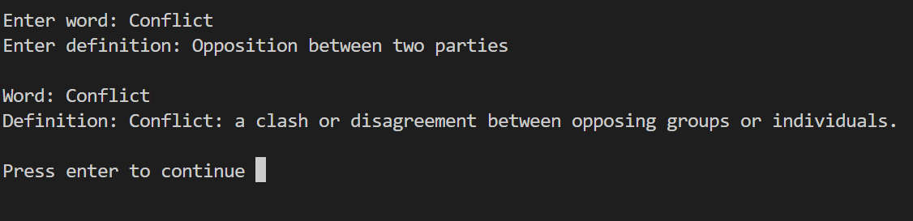

# WonderWord

## A Python program to help practise spelling and vocabulary
WonderWord is a Python program designed to help improve your spelling and vocabulary. It uses the pyttsx3 text-to-speech library to help user's with their pronounciation. The program will save words to a JSON file so that users can keep practising with the same words.

The project was a good opportunity to learn about how to generate random words in Python using the wonderwords package, how to use the pyttsx3 libray to turn text into speech, using an API to get the definition of a word, and how to use the llama3.2 Large Language Model locally in Python to rephrase some text.

## Demo

## Instructions
Clone the git repo and run main.py. You will also need to install ollma and then in cmd run "ollama pull llama3.2" to download the llama3.2 model.

Ollama: [https://ollama.com/](https://ollama.com/)